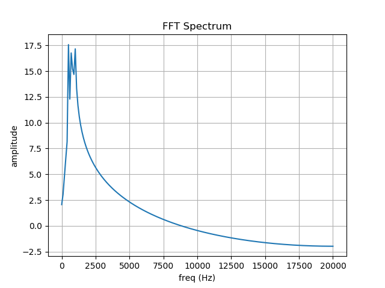
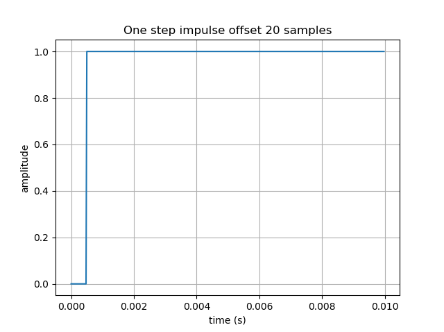

# Test signal generators
This is an implementation in Python of algorithms to generate several different test signals.   

## Description
In this Python implementation, you can find the following test signal implementations:  

1. Simple sine or cosine functions with phase.
2. Two crafted sinusoids combined.
3. N crafted sinusoids combined.
4. Chirp from freq A to freq B can also be called a continues frequency sweep.
5. One Dirac impulse.
6. One step cycle function.    
7. One square cycle function.
8. Square wave function.
9. Uniform noise from freq A to freq B.

 
The spectrum amplitude of each signal is also showed.

## 1. Simple sine or cosine functions with phase.

## 2. Two crafted sinusoids combined.

## 3. N crafted sinusoids combined.

## 4. Chirp from freq A to freq B can also be called a continues frequency sweep.

## 5. One Dirac impulse.

## 6. One step cycle function.    

## 7. One square cycle function.

## 8. Square wave function.

## 9. Uniform noise from freq A to freq B.

# License
MIT Open Source license.

# Have fun!
Best regards,  
Joao Nuno Carvalho 